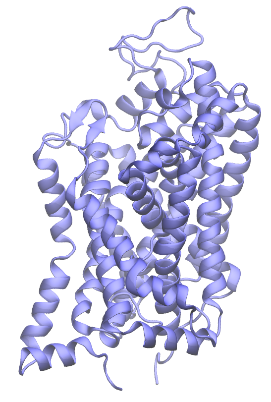
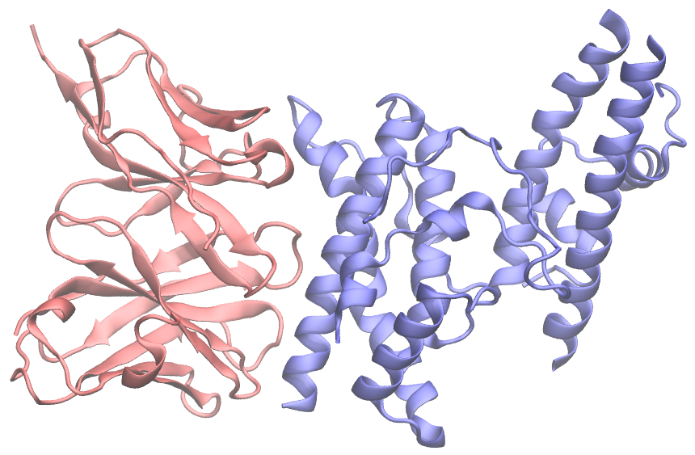
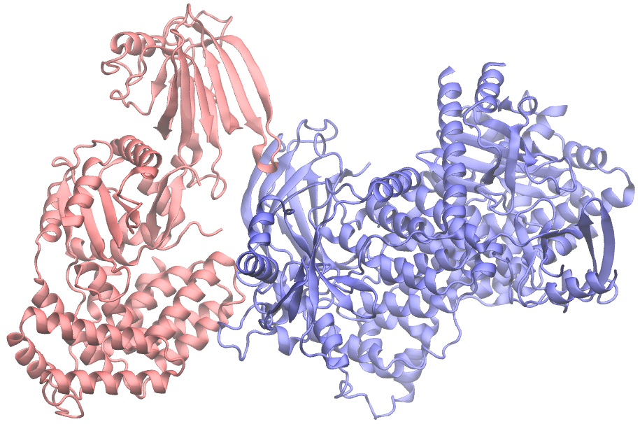
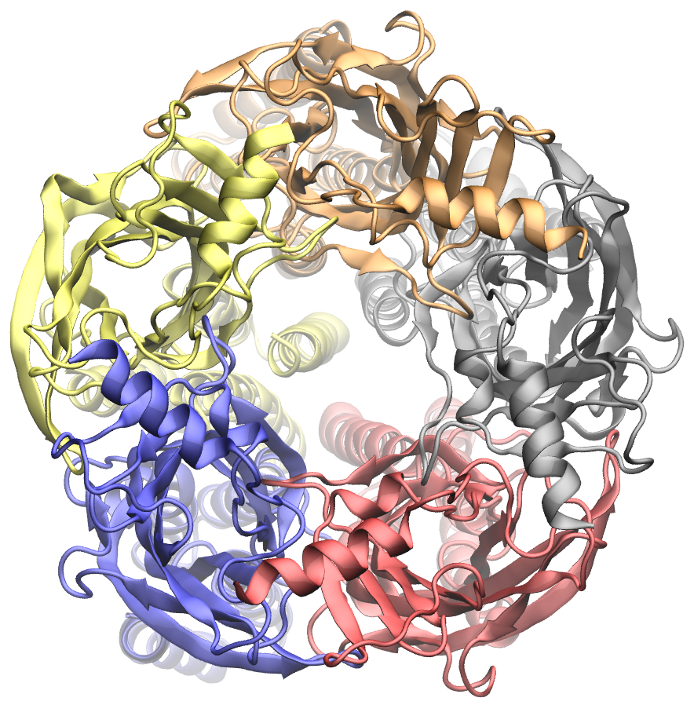

<p align="center">
  
  
  
  
</p>

## APACE Features
1. CPU/GPU parallelization on HPC
2. Conformational sampling as in ColabFold and others
3. PDB conditioning as in AlphaFlow

## APACE Instructions to Create and Submit Jobs

Below are the guidelines for creating the job script and submitting the job on the Delta supercomputer.
### APACE The Job Script
We'll walk through the script step by step to ensure you understand its functionality. The sample job script can be located in the GitHub repository under the name *"monomer template job script.sh"*
1.	#!/bin/bash
   
    The script will commence just like a standard shell script, usually by invoking Bash

2.	Set suitable SLURM parameters

    Any line beginning with *#SBATCH* serves as an instruction for the scheduler. These lines specify the resources required for your job and can define various settings.

  	The subsequent lines pertain to the resources your job will utilize. In this instance, we're employing 2 A40 GPU nodes while ensuring exclusivity, preventing other jobs from utilizing them. Each node will run one task (singularity container), which can access up to 64 cores. We've allocated 4 GPUs per node and 240GB of memory.

    ```bash
    #SBATCH --mem=240g  # Adjust this based on your memory requirements per node
    #SBATCH --nodes=2  # Adjust this according to the number of compute nodes/GPUs you need for predicting the structure
    
    #SBATCH --exclusive
    #SBATCH --ntasks-per-node=1  # Leave this parameter unchanged. After extensive job runs and parameter adjustments, we've observed that ray typically permits only one worker per node. Therefore, we now establish a single worker per compute node, allocating all 4 GPUs to it, and we allow ray to automatically distribute tasks across available GPUs. Initially, we were allocating just 1 GPU per worker node.
    
    #SBATCH --cpus-per-task=64    # Assign all CPUs on node as all the MSA tools run in parallel. Let ray decide distribution. 
    #SBATCH --gpus-per-task=4     # Assign all GPUs on node. Let ray decide distribution
    
    #SBATCH --partition=gpuA40x4      # <- or one of: gpuA100x4 gpuA40x4 gpuA100x8 gpuMI100x8
    
    #SBATCH --gpus-per-node=4    # Adjust the following parameter based on the number of GPUs required for the job on each node. It's advisable to allocate all GPUs on the node, considering the exclusive mode we're using, and allow ray to handle the distribution.
    
    #SBATCH --gpu-bind=closest     # <- or closest
    ```

    Next, we will assign a meaningful name to the job which will be displayed in the scheduler
    
    ```bash
    #SBATCH --job-name=predicting_protein
    ```
    
    Then specify the maximum runtime for the job. The job will be terminated if it exceeds this time limit. Setting a reasonable time limit helps prevent unnecessary costs and improves queue efficiency. It also increases the chances of fitting the job into available time slots.
    
    ```bash
    #SBATCH --time=03:00:00      # hh:mm:ss for the job
    ```
    
    Next we will instruct Slurm to connect the batch script's standard error and output directly to the file name specified in the "filename pattern". By default both standard output and standard error are directed to the same file. For job arrays, the default file name is "slurm-%A_%a.out", "%A" is replaced by the job ID and "%a" with the array index. For other jobs, the default file name is "slurm-%j.out", where the "%j" is replaced by the job ID. See the filename pattern section below for filename specification options.
    ```bash
    #SBATCH -e protein_ABC-err-%j.log
    #SBATCH -o protein_ABC-out-%j.log
    ```
    
    Users can specify which features or filesystems are required by the job using the constraint option. We request that jobs specify filesystems or resources being used in order for Delta to respond to resource availability issues. 

    ```bash
    #SBATCH --constraint="scratch&ime"  # we are using 2 filesystems (ime and scratch) for running prediction
    ```
    
    Next, use the --account parameter to charge resources used by this job to the specified account.
    ```bash
    #SBATCH --account=bblq-delta-gpu
    ```
    
    The next two lines are about having the scheduler keep you informed about when the job starts and ends. Make sure to replace *"your-email@example.com"* with your actual email address. You can also omit these lines if you prefer not to be emailed.

    ```bash
    #SBATCH --mail-user= your-email@example.com
    #SBATCH --mail-type="BEGIN,END" # See sbatch or srun man pages for more email options
    ```
    
3.	Load the necessary modules

    ```bash
  	module purge
    module load cue-login-env/1.0 gcc/11.2.0 ucx/1.11.2 openmpi/4.1.2 cuda/11.6.1 modtree/gpu default
    ```

4.  Navigate to the directory where you've cloned the alphafold repository

    Change the current working directory to the location of your cloned alphafold repository:

    ```bash
    cd /scratch/bblq/johndoe/alphafold
    ```
    
5.	To prevent Out-of-Memory (OOM) errors, we included the following commands based on the guidelines provided in the link (https://jax.readthedocs.io/en/latest/gpu_memory_allocation.html)

    ```bash
  	export XLA_PYTHON_CLIENT_PREALLOCATE="false"
    export XLA_PYTHON_CLIENT_MEM_FRACTION=".75"
    export XLA_PYTHON_CLIENT_ALLOCATOR="platform"
    ```
    
7.	The subsequent commands are necessary to initiate the Ray Cluster on SLURM. For more comprehensive information, please refer to the guide available at (https://docs.ray.io/en/latest/cluster/vms/user-guides/community/slurm.html)

    ```bash
  	# Getting the node names
    nodes=$(scontrol show hostnames "$SLURM_JOB_NODELIST")
    nodes_array=($nodes)
    
    head_node=${nodes_array[0]}
    head_node_ip=$(srun --nodes=1 --ntasks=1 -w "$head_node" hostname --ip-address)
    
    # if we detect a space character in the head node IP, we'll
    # convert it to an ipv4 address. This step is optional.
    if [[ "$head_node_ip" == *" "* ]]; then
    IFS=' ' read -ra ADDR <<<"$head_node_ip"
    if [[ ${#ADDR[0]} -gt 16 ]]; then
      head_node_ip=${ADDR[1]}
    else
      head_node_ip=${ADDR[0]}
    fi
    echo "IPV6 address detected. We split the IPV4 address as $head_node_ip"
    fi
    # __doc_head_address_end__
    
    # __doc_head_ray_start__
    port=6379
    ip_head=$head_node_ip:$port
    export ip_head
    echo "IP Head: $ip_head"
    
    export head_node_ip
    export port
    ```

7.	Now we move to the actual instructions that will be executed on the compute node during runtime.

    We employ srun, using the message passing interface (MPI), to initiate the workers on the compute nodes. This step is crucial because the sbatch script runs exclusively on the first compute node.
    
    The value provided to the -n and --gpus-per-task parameters must correspond to the --nodes and --gpus-per-task parameters set earlier.
    
    ```bash
  	srun -n 2 --gpus-per-task 4 --wait=10 \
    ```
    
    We have incorporated the *"--wait"* option in the srun command to conclude the job once the prediction is finished. Previously, the job remained active even after prediction completion. This occurred because the head node exited after prediction, while the worker nodes were still active. The "wait" option terminates other processes once one of them is completed.
    
    Since Docker support is not available on Delta, we couldn't use the conventional run_docker.py script. Instead, we attempted to emulate the core functionalities of run_docker.py. By utilizing a singularity run command, we aptly set up the essential mounts and included the necessary flags for execution. This process was designed to mirror the actions of run_alphafold.py using Docker. Adjust the mount paths and parameters based on your requirements and protein type (monomer or multimer). The example script provided demonstrates structure prediction for a monomer.
    
    ```bash
  	singularity run --nv \
    --bind /scratch/bblq/johndoe/inputs/:/mnt/fasta_inputs \
    --bind /ime/bblq/johndoe/dataset_path/uniref90:/mnt/uniref90_database_path \
    --bind /ime/bblq/johndoe/dataset_path/mgnify:/mnt/mgnify_database_path \
    --bind /ime/bblq/johndoe/dataset_path:/mnt/data_dir \
    --bind /ime/bblq/johndoe/dataset_path/pdb_mmcif/mmcif_files:/mnt/template_mmcif_dir \
    --bind /ime/bblq/johndoe/dataset_path/pdb_mmcif:/mnt/obsolete_pdbs_path \
    --bind /ime/bblq/johndoe/dataset_path/pdb70:/mnt/pdb70_database_path \
    --bind /ime/bblq/johndoe/dataset_path/uniref30:/mnt/uniref30_database_path \
    --bind /ime/bblq/johndoe/dataset_path/bfd:/mnt/bfd_database_path \
    --bind /scratch/bblq/johndoe/outputs/proteinABC:/mnt/output \
    ../alphafold_CPU_GPU_scaled.sif --fasta_paths=/mnt/fasta_inputs/6awo.fasta \
    --uniref90_database_path=/mnt/uniref90_database_path/uniref90.fasta \
    --mgnify_database_path=/mnt/mgnify_database_path/mgy_clusters_2022_05.fa \
    --data_dir=/mnt/data_dir \
    --template_mmcif_dir=/mnt/template_mmcif_dir \
    --obsolete_pdbs_path=/mnt/obsolete_pdbs_path/obsolete.dat \
    --pdb70_database_path=/mnt/pdb70_database_path/pdb70 \
    --uniref30_database_path=/mnt/uniref30_database_path/UniRef30_2021_03 \
    --bfd_database_path=/mnt/bfd_database_path/bfd_metaclust_clu_complete_id30_c90_final_seq.sorted_opt \
    --output_dir=/mnt/output \
    --max_template_date=2023-07-13 \
    --db_preset=full_dbs \
    --model_preset=monomer \
    --benchmark=False \
    --use_precomputed_msas=True \
    --num_multimer_predictions_per_model=5 \
    --models_to_relax=all \
    --use_gpu_relax=True \
    --logtostderr \
    --perform_MD_only=False \
    --use_amber=True \
    --alphaflow_cond_pdb=path/to/file.pdb
    
    echo "Job Completed"
    ```


### APACE Submitting your job

Submitting your job is a straightforward process. After preparing your submission script with the desired options, you can simply submit it using the *"sbatch"* command. It will provide you with a job ID:

```bash
[parthpatel@dt-login01 job_script]$ sbatch delta_monomer_template_job_script.sh
Submitted batch job 2316719
```

While the job is running, you'll find two output files named *“predicting_protein_ABC-err-2316719.log”* and *“predicting_protein_ABC-err-2316719.log”* in your working directory, Additionally, the job's output files will be stored in the output directory that you specified in your submission script.


# AlphaFold

This package provides an implementation of the inference pipeline of AlphaFold
v2. For simplicity, we refer to this model as AlphaFold throughout the rest of
this document.

We also provide:

1.  An implementation of AlphaFold-Multimer. This represents a work in progress
    and AlphaFold-Multimer isn't expected to be as stable as our monomer
    AlphaFold system. [Read the guide](#updating-existing-installation) for how
    to upgrade and update code.
2.  The [technical note](docs/technical_note_v2.3.0.md) containing the models
    and inference procedure for an updated AlphaFold v2.3.0.
3.  A [CASP15 baseline](docs/casp15_predictions.zip) set of predictions along
    with documentation of any manual interventions performed.

Any publication that discloses findings arising from using this source code or
the model parameters should [cite](#citing-this-work) the
[AlphaFold paper](https://doi.org/10.1038/s41586-021-03819-2) and, if
applicable, the
[AlphaFold-Multimer paper](https://www.biorxiv.org/content/10.1101/2021.10.04.463034v1).

Please also refer to the
[Supplementary Information](https://static-content.springer.com/esm/art%3A10.1038%2Fs41586-021-03819-2/MediaObjects/41586_2021_3819_MOESM1_ESM.pdf)
for a detailed description of the method.

**You can use a slightly simplified version of AlphaFold with
[this Colab notebook](https://colab.research.google.com/github/deepmind/alphafold/blob/main/notebooks/AlphaFold.ipynb)**
or community-supported versions (see below).

If you have any questions, please contact the AlphaFold team at
[alphafold@deepmind.com](mailto:alphafold@deepmind.com).


